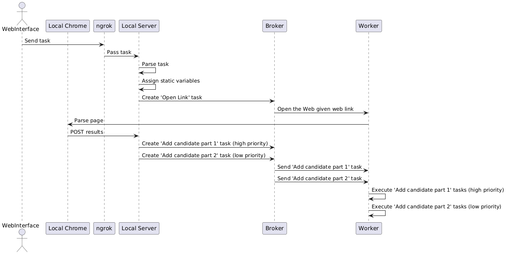

<!-- Title -->

<h1>Auto Candidate</h1>

<!-- Badges -->

    
    

 

<!-- Table of Contents -->

# Table of Contents

- [About the Project](#about-the-project)
  - [Summary](#summary)
  - [Tech Stack](#tech-stack)
  - [Control Flow](#control-flow)
- [Contact](#contact)
- [Acknowledgements](#acknowledgements)

<!-- About the Project -->

# About the Project

<!-- Summary -->

### Summary

Auto Candidate is a tool I developed for Solution Based Therapeutics (SBT) to automate the process of aggregating data from various job boards and uploading it to a central database. It also interfaces with Twilio to send batch texts and emails.

What started as a project to assist with my role at SBT quickly grew into the complete solution. As its functionality expanded, so did its complexity, particularly to support parallelization, ultimately evolving into the robust tool it is today.

<!-- Tech Stack -->

### Tech Stack

<!-- Shields.io Badges: https://github.com/Ileriayo/markdown-badges -->

    
Client

     
    
    
    
    

    
Server

     
    
    
    
    
    
    
    
    

    
Database

     
    

    

    
Deployment

     
    

<!-- Control Flow -->

### Control Flow

Given the sensitive nature of some of the data involved in this project, I decided to use UserScripts for data extraction on locally hosted servers. These scripts then forward the extracted data to its final destination.

To manage the project's workflow more effectively, a Task Queue and Worker were implemented. While this introduced additional complexity and overhead, it also enabled parallelization of certain tasks, improving efficiency.

This project primarily handles two types of tasks: sending emails and messages, and aggregating and uploading data. The messaging aspect is relatively straightforward, but the candidate-adding process requires a more intricate control flow, which is detailed in the accompanying sequence diagram.

<!-- Contact -->

## Contact

#### Victor Rinaldi:

<!-- Acknowledgments -->

## Acknowledgements

- [Charles Zhang README](https://github.com/czhangy)
- [Shields.io](https://shields.io/)
- [PlantUML](https://plantuml.com/)
